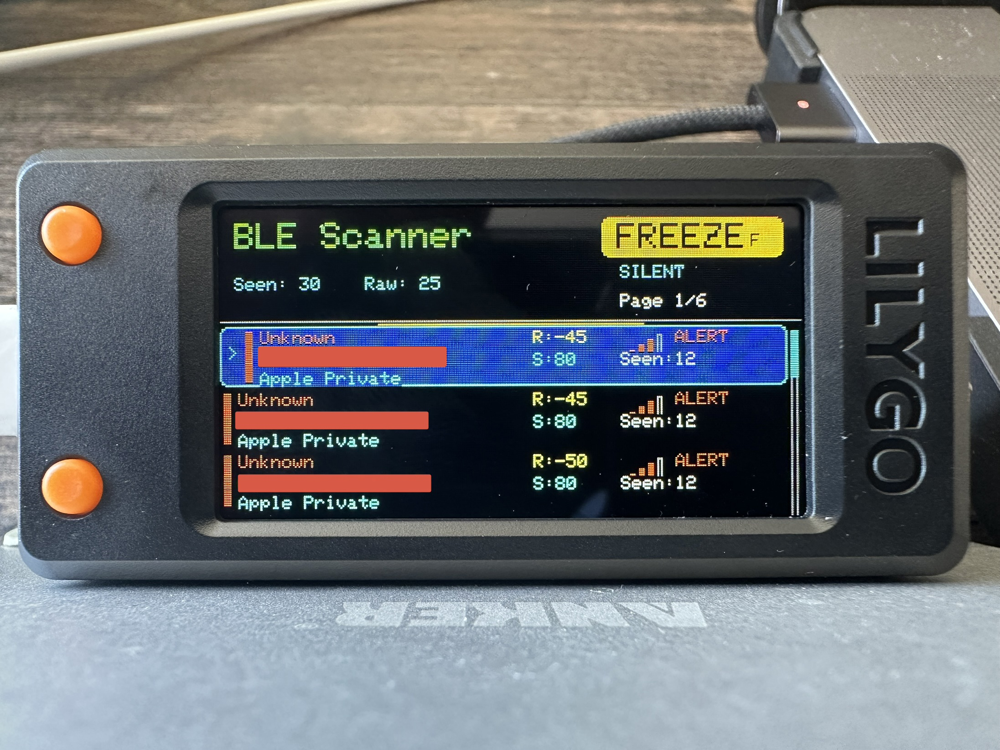
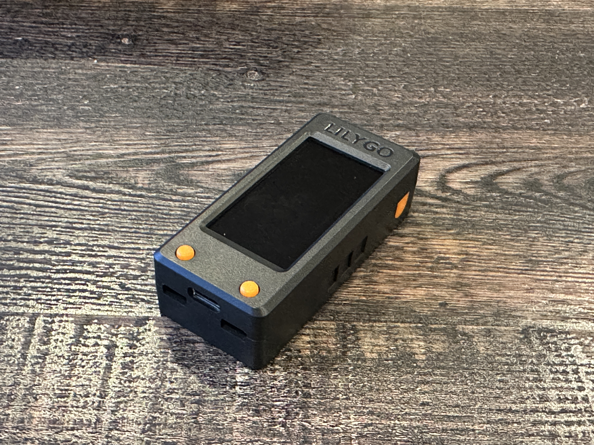
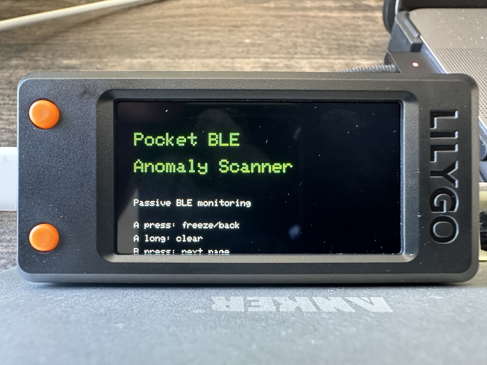
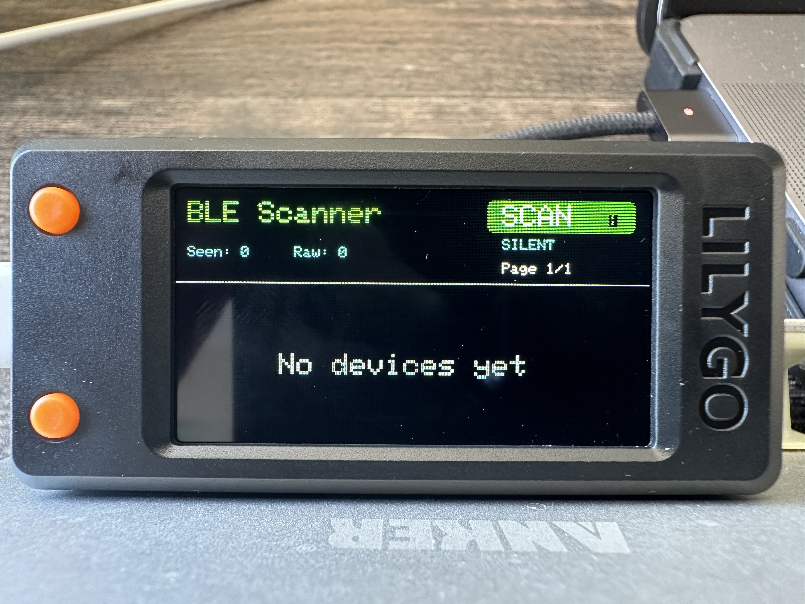
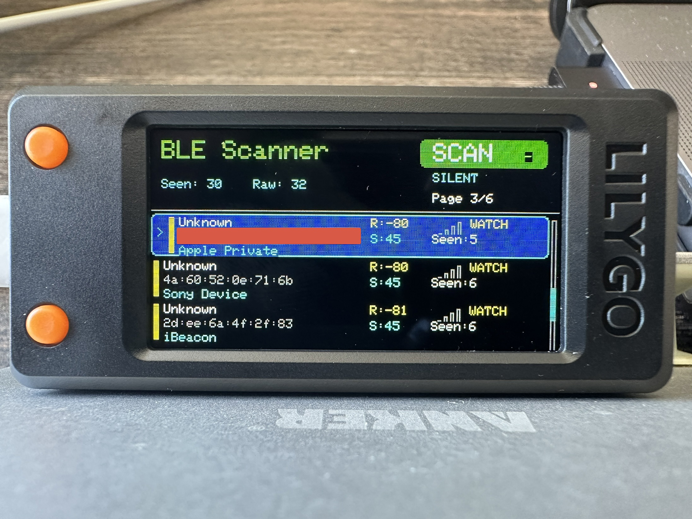
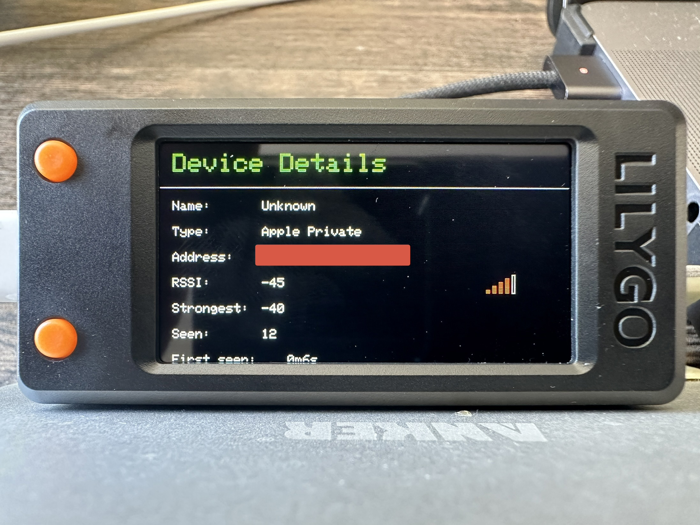

# Pocket BLE Anomaly Scanner

## About:
This project focuses on defensive wireless awareness, embedded firmware development, and portable cybersecurity tooling using Bluetooth Low Energy (BLE) scanning and lightweight UI workflows. The scanner passively observes nearby BLE advertisements and provides a handheld interface.

#### Examples:
* BLE device discovery
* RSSI proximity awareness
* device history tracking
* suspicion scoring
* trusted/untrusted device management
* advanced BLE fingerprinting
* device type inference
* serial logging export
* portable freeze/review workflows

## Features:
### BLE Monitoring:
- Passive BLE scanning
- RSSI signal visualization
- Signal bars and threat highlighting
- Nearby device awareness
- Portable freeze/review workflow

### Device Awareness:
- Device type inference
- Device history tracking
- First seen/last seen tracking
- Strongest RSSI tracking
- Seen count tracking

### Advanced BLE Classification:
* Service UUID analysis
* Appearance value analysis
* Manufacturer/vendor fingerprinting
* Beacon classification
* Apple private advertisement detection
* Private BLE heuristics

### Trusted Device System:
* Trusted device watch list
* Runtime trust/untrust management
* Device details view
* Persistent trusted-device support

### UI Features:
* Embedded TFT UI
* Selected row highlighting
* Scroll bar and page navigation
* Device details screen
* FREEZE mode for stable analysis
* Reduced flicker redraw optimization

### Logging:
* CSV-friendly serial export logging
* USB serial monitoring support

## Hardware:

* [LILYGO T-Display S3 (ESP32-S3)](https://www.amazon.com/dp/B0BRTT727Z?ref=ppx_yo2ov_dt_b_fed_asin_title&th=1)
* USB-C cable
* (Optional) USB-C battery bank

## Software Stack
* Arduino IDE
* ESP32 Arduino Framework
* TFT_eSPI
* ESP32 BLE Libraries

## Current Limitations:
* BLE only
* No Wi-Fi scanning
* No packet capture
* No BLE decryption
* No persistent storage yet
* No SD card export yet
* No battery telemetry yet
* Apple BLE privacy randomization may rotate addresses
* Some BLE devices intentionally hide names

---

## Future Improvements:
### Wireless Analysis:
* Manufacturer database lookup
* Enhanced BLE service UUID analysis
* Rotating MAC correlation
* Behavioral fingerprinting
* Signal trend graphing
* Advertisement timing analysis

---

### Storage & Export:
* SPIFFS logging
* SD card export
* Saved trusted-device database
* Full CSV export workflows

---

### Portable Features:
* Battery percentage monitoring
* Sleep/stealth mode
* Low-power operation
* Rechargeable LiPo enclosure
* Vibration alerts

---

## How To: Install
### Install & Setup
1. Install: [Arduino IDE](https://www.arduino.cc/en/software/)
2. Open Arduino IDE: Go to: Settings > Additional Boards Manager > Add ESP32 Board Package: [URL](https://raw.githubusercontent.com/espressif/arduino-esp32/gh-pages/package_esp32_index.json):
3. Go to: Tools > Board > Boards Manager > Install ESP32 _(by Espressif Systems)_ 
4. Go to: Sketch > Include Library > Manage Libraries > Install TFT_eSPI > Install ESP32 BLE Arduino
5. Go to Tools: Configure Board Settings
   * Board: ESP32S3 Dev Module
   * USB CDC On Boot: Enabled
   * Upload Mode: UART0 / Hardware CDC
   * Port: ESP32 device
6. Connect the ESP32-S3 board via USB-C & plug into your machine's USB-C port

### How To: Run The Tool (Arduino IDE)
1. Power on the BLE device by selecting the orange side button
2. Open the `pocket_ble_anomaly_scanner.ino` with Arduino IDE > Click: Upload
3. Wait for the process to compile, then the scanner program will load

4. Then the scanner UI will load 

5. The BLE scan will automatically begin

### Recommended Workflow
1. Press A to freeze the list
   

2. Press B to move to the next page of detected devices
3. Press A + B to open Device Details for the selected device
   

5. While in Device Details, press B to move through individual devices
6. Long-press B to trust or untrust the selected device
7. Press A to return from Device Details
8. Press A again to resume scanning

---

## Improvement Ideas:
* Trend graphs
* Heatmaps
* Device filtering
* Category sorting
* Wireless recon dashboard integration

---

## Educational Focus:
This project was built as a hands-on embedded cybersecurity and wireless awareness learning platform covering:
* ESP32 firmware development
* BLE fingerprinting
* Bluetooth SIG manufacturer analysis
* Embedded UI systems
* State management
* Hardware debugging
* Embedded performance optimization
* Defensive wireless reconnaissance concepts

---

## Security Notes:
* This project is intended for learning, personal security practice, and portfolio demonstration.
* The scanner passively observes BLE advertisements and does not interact with payment terminals, card readers, or protected wireless systems.
